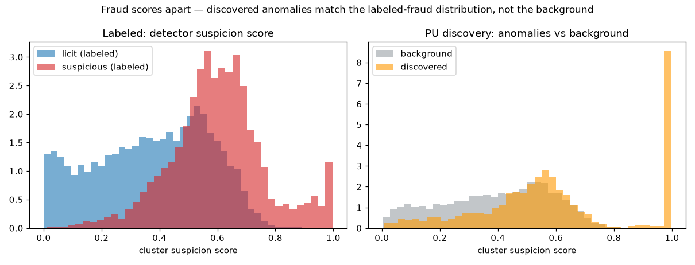

# ellip2 — Money-laundering subgraph detection & discovery on Elliptic2

[](https://github.com/owgreen-dev/ellip2/actions/workflows/ci.yml)
[](pyproject.toml)
[](LICENSE)
[](DATA.md)
[](RESULTS.md)
[](RESULTS.md)
[](https://github.com/astral-sh/ruff)

> **Read a Bitcoin subgraph, score how much it looks like money laundering — then find the
> ones nobody labeled.** A from-scratch **border Deep Sets** detector reaches **PR-AUC
> 0.911 ± 0.009** on Elliptic2's 121,810 labeled subgraphs (beats GLASS, trails published
> SOTA by ~0.06 same-architecture), then **discovers** novel suspicious structures in a
> **49.3M-cluster** unlabeled background at **121× lift** over random.

A research pipeline for anti-money-laundering (AML) analysis of the **Elliptic2** Bitcoin
dataset. It does two things on the 121,810 labeled connected components and the ~48.8M
unlabeled background clusters:

1. **Detect** suspicious *subgraphs* among the labeled connected components (supervised
   border model, PR-AUC **0.942**).
2. **Discover** novel suspicious *subgraphs* among the ~48.8M *unlabeled* background
   clusters (per-cluster score → reachability carve → border re-score → ranked leads).

Everything runs offline on CPU for the tests; the real end-to-end run is a GPU box step.
See [RESULTS.md](RESULTS.md) for the full metrics table and baseline comparison.

## Why this matters now

Blockchain laundering is an active enforcement front, not a solved problem. The typologies
this pipeline scores for — layering flows through intermediary clusters, fan-in/fan-out
structuring, exit toward cash-out endpoints — are the same mechanics behind live cases:
**pig-butchering** rings moving victim funds, **sanctions-linked** laundering (mixers and
bridge hops), and the wave of **FinCEN** advisories pushing institutions from
transaction-level to *network-level* monitoring. The hard part in practice isn't scoring a
subgraph someone already flagged — it's **surfacing the ones nobody labeled**. That
discovery stage, not the leaderboard number, is the point of this repo.

## Overview

Elliptic2 ("The Shape of Money Laundering") labels whole *subgraphs* of the Bitcoin
transaction graph as licit or suspicious, at a **2.27%** base rate (2,763 suspicious /
119,047 licit). The detection model is a **Deep Sets border model**: it pools the external
*senders* and *receivers* of a candidate subgraph together with its pooled internal node
and edge features, then classifies with an MLP under a weighted BCE loss. On top of
detection, a background-discovery stage surfaces novel suspicious structures that were
never labeled, using a per-cluster suspicion score, a bounded ≤k-hop exit-path
reachability carve toward heuristic licit endpoints, and a one-at-a-time border re-score.

## Results

Detection progression on stratified 80/10/10 splits (test PR-AUC), each row a distinct
modeling choice:

| Model | test PR-AUC |
|---|---|
| cluster-level nnPU GNN (rejected framing) | 0.030 |
| pooled-features HGBM | 0.286 |
| border model, nodes only | 0.816 |
| border model + internal edge features | 0.844 |
| **border model, tuned** | **0.911 ± 0.009** |

The tuned border model scores **PR-AUC 0.911 ± 0.009** across 5 stratified splits with
**best-of-3 validation-based model selection** (best single split 0.942). Selection matters:
a *single* run is unstable — 1 in 5 fresh splits collapses to ~0.38 — so we keep the
best-validation restart (`train_border --restarts`). See [RESULTS.md](RESULTS.md) for the
full robustness analysis.

Named-table baseline comparison — **RevTrack Table 1 (GPU + node features)**:

| Model | PR-AUC | F1 |
|---|---|---|
| RevClassify_DS (SOTA, border Deep Sets) | 0.974 | 0.953 |
| **Ours (border, best-of-3, 5-split)** | **0.911 ± 0.009** | 0.78 (0.89 val-tuned) |
| GLASS | 0.816 | 0.705 |

Ours beats GLASS and trails RevClassify_DS by ~0.06 PR-AUC (same border-Deep-Sets
architecture, reimplemented from scratch). This is an **approximate, different-split**
comparison, not identical-split — see [RESULTS.md](RESULTS.md) for caveats.

**Discovery:** 208 novel candidate subgraphs surfaced from the 49.3M-cluster background;
held-out-recovery proxy eval re-found **5 of 276** held-out test-suspicious subgraphs
(**1.8% recall**) against a random baseline of 0.0001 → **121× lift**.

Each lead is rendered as an investigative card — a **border graph** (external *senders* →
*internal* cluster → external *receivers*) plus an LLM typology and a corroborating exit
path. Example (a novel lead the pipeline **discovered**, score 1.0):


More discovered-lead cards in [`docs/examples/`](docs/examples/).

**What fraud looks like** — a visual [demo](docs/examples/DEMO.md) over ~32K clusters (labeled
suspicious / licit / background / discovered). The detector's score separates known fraud, and the
**discovered anomalies match the fraud distribution, not the background**:



Full anatomy (feature fingerprints + a 2D node map) in [`docs/examples/DEMO.md`](docs/examples/DEMO.md).

## What breaks in the wild

Elliptic2 is a curated academic benchmark, so the fair first challenge is *"you benchmarked
on a benchmark."* Here is what a 0.911 PR-AUC does **not** promise in production, and how the
design anticipates it:

- **Label leakage / temporal realism.** The published splits are stratified, not
  strictly time-ordered. Real deployment must train only on the past — so the repo carries
  explicit leakage checks (`eval/leakage_checks`) and the discovery stage is evaluated by
  *held-out recovery*, which is a harder, more deployment-like proxy than in-split PR-AUC.
- **Distribution shift.** Labels reflect one snapshot of one chain's typologies. New
  cash-out venues, chains, and bridges shift the feature distribution; the honest read is
  that the border model would need periodic re-fit and the per-cluster scorer (already the
  weak link at PR-AUC 0.127) degrades first. This is why leads are ranked and
  human-reviewed via evidence cards rather than auto-actioned.
- **Adversarial adaptation.** Once a structural detector is known, launderers restructure —
  smaller subgraphs, padded licit-looking flows, split exits. The border framing (external
  senders/receivers + exit-path corroboration) is chosen precisely because it keys on flow
  *shape* rather than a memorizable fingerprint, but no structural detector is
  adversarially stable on its own; it's a lead-generation layer, not a verdict.

The takeaway isn't "this generalizes for free" — it's that the pipeline is built to fail
*loudly* (leakage checks, recovery proxy, ranked human-in-the-loop leads) rather than
quietly overfit a leaderboard.

## Pipeline

```
Stage 0  ingest        DuckDB out-of-core  -> edge_index.npy, node_features.npy, subgraphs.parquet
   |
Stage 1  features      degree, flow-concentration, neighborhood, temporal, path-role
   |                   -> cluster_features.parquet
   |
Stage 2  detection     border model: DeepSets(senders) + DeepSets(receivers)
   |                   + pooled internal node/edge features -> MLP (weighted BCE)  [PR-AUC 0.942]
   |
Stage 3  exit paths    bounded <=k-hop reachability to heuristic licit endpoints (corroboration)
   |
Stage 4  cards         LangGraph typology agent (Bedrock Claude) + structural validator + graph viz
   |
Discovery              per-cluster HGBM score -> 3-gate funnel -> per-candidate carve
                       -> border re-score -> ranked novel leads
```

## Quickstart

This repo uses `uv` and a project `.venv` (no system pip):

```bash
uv venv .venv
uv pip install --python .venv/bin/python -e '.[dev]'

# See it work end-to-end in <2 min, zero credentials, CPU only:
# trains the real border detector on a synthetic graph and renders an
# investigative card into demo_out/ (no Kaggle download, no AWS/Bedrock).
make demo            # or: .venv/bin/python scripts/demo.py

# run the full gate (pytest + ruff + mypy)
bash scripts/verify.sh   # or: make verify

# or just the tests
.venv/bin/python -m pytest -q   # or: make test
```

The `make demo` card is the same layout as the discovered-lead cards above (border graph +
structural typology + exit-path corroboration + caveats) — see a full one narrated in the
[investigator walkthrough](docs/examples/WALKTHROUGH.md).

## Data

- **Source:** Kaggle `ellipticco/elliptic2-data-set` (paper *"The Shape of Money
  Laundering"*).
- **Size:** ~24 GB compressed / **~83 GB extracted** (5 CSVs).
- **License:** **CC BY-NC-ND 4.0** — non-commercial, no-derivatives. The dataset is **NOT
  redistributed** in this repo; download it from Kaggle yourself. See [DATA.md](DATA.md).
- **Counts (paper Table 1):** 49,299,864 background clusters · 196,215,606 background
  edges · 121,810 labeled subgraphs (2,763 suspicious / 119,047 licit; base rate 2.27%).
  43 node features, 96 edge feature columns.

## Reproduce

The real, GPU-scale end-to-end run (ingest → split → features → train/score → discovery →
eval) is documented in [RUNBOOK.md](RUNBOOK.md), including the AWS instance and cost notes.
The offline CPU test suite (`bash scripts/verify.sh`) exercises every module on synthetic
fixtures.

**No hand-typed numbers.** Every headline metric in this README and [RESULTS.md](RESULTS.md)
is asserted against a single machine-readable source of truth, [`facts.json`](facts.json), by
[`tests/test_published_numbers.py`](tests/test_published_numbers.py) — which runs in the CI
gate, so the build fails if a quoted number drifts from the canonical value. Run it alone with
`make check-numbers`.

The design decisions behind the pipeline — why the border model over a GNN, why best-of-N
restart selection, why the discovery cascade — are written up as ADRs in
[docs/decisions.md](docs/decisions.md).

## Repo layout

- `src/ellip2/` — ~50 typed modules:
  - `data/` — Stage 0 ingest (DuckDB out-of-core) + schema.
  - `features/` — degree, edge_aggs, flow_concentration, neighborhood, temporal,
    path_role, build.
  - `graph/` — PyG `Data` construction + neighbor sampling.
  - `pu/` — border/subgraph models, nnPU loss, prior estimation, encoder, trainer,
    cluster_score.
  - `exit_paths/` — bounded reachability BFS + endpoint recovery.
  - `discovery/` — background discovery orchestrator + held-out-recovery eval.
  - `eval/` — splits, PU metrics, leakage checks.
  - `llm/` — subgraph serialization, Bedrock client, LangGraph typology agent.
  - `report/` — per-subgraph investigative card rendering + lead ranking.
- `scripts/` — 18 thin CLIs (`train_border.py`, `score_border.py`, `make_split.py`,
  `build_features.py`, `discover_subgraphs.py`, `eval_recovery.py`, …).
- `configs/` — composable Hydra-style config tree.
- `tests/` — synthetic / CPU-only / mocked test suite.

## Limitations

- Discovery recall is low (1.8%, top-500 candidates only); raising top-K trades compute
  for recall.
- **Training instability**: a single border-model run collapses ~1 in 5 times (degenerate
  all-positive). We mitigate with best-of-N validation-based selection (`--restarts`); the
  reported 0.911 ± 0.009 uses best-of-3.
- The baseline comparison uses a **different split** than RevTrack (approximate, not
  identical-split — their exact random split has no published seed).
- The per-cluster suspicion scorer that drives discovery is weak (test-member PR-AUC
  0.127).
- LLM typologies are unvalidated — the dataset has no ground-truth typology labels.

## Part of a method family

Same methodology, different domain: **public data → detectors → enforcement labels → PU
benchmarks**. ellip2 is the **graph** instance of that recipe — the border framing and the
bounded ≤k-hop exit-path carve are the reusable pieces.

- **[relief-probe](https://github.com/owgreen-dev/relief-probe)** — the tabular instance:
  finding fraud leads in **11.4M public PPP loans**, validated against real DOJ prosecutions
  (**23.8× lift at k=500**), honest about what works and what doesn't.
- **tranship-probe** *(planned)* — the trade/transshipment instance: entity resolution and
  ring expansion over shipping records. Its Level-2 roadmap reuses ellip2's graph techniques
  (border scoring, ring-expansion carve) directly.

Each repo takes the same discipline to a different public dataset; together they're a body of
work, not three one-offs.

## Disclaimer

This project **surfaces investigative leads, not findings or accusations.** It uses only
public / benchmark data (Elliptic2), establishes no wrongdoing about any entity, and is not
affiliated with any enforcement body. Every lead is a model output requiring human review —
the scores are positive-unlabeled lower bounds, and node roles / endpoint types are derived
heuristics, not ground-truth labels. See the per-card caveats in
[`docs/examples/`](docs/examples/).

## License

Code is licensed **MIT** — see [LICENSE](LICENSE). The Elliptic2 **data** is CC
BY-NC-ND 4.0 (non-commercial) and is not included here.

## Citation

If you use this work, cite the two underlying papers:

- Elliptic2 dataset / GLASS — *The Shape of Money Laundering* — **arXiv:2404.19109**.
- RevClassify / RevTrack — *Identifying Money Laundering Subgraphs on the Blockchain*
  (ACM AIF 2024) — **arXiv:2410.08394**.
