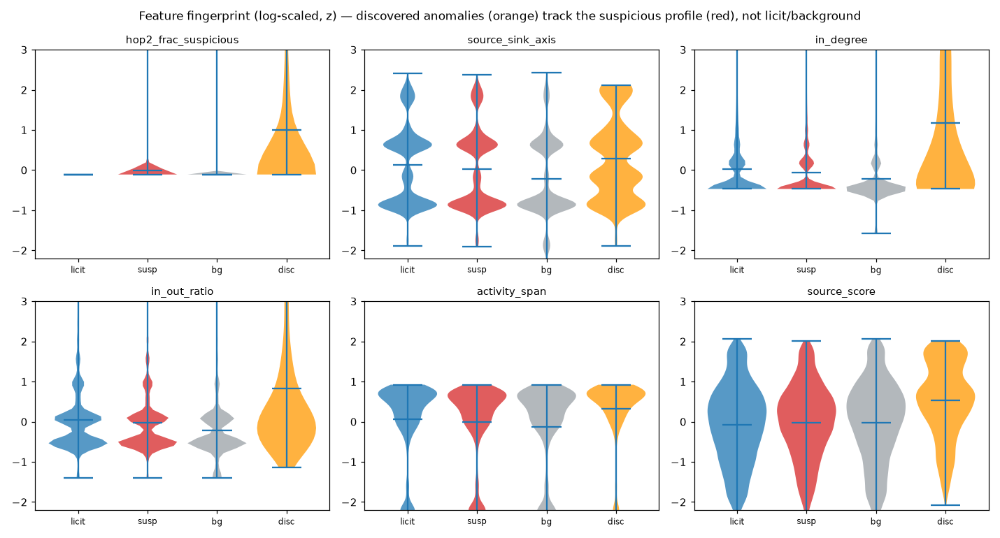
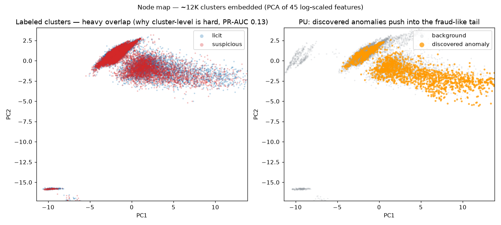

# Demo — the anatomy of laundering (fraud vs. not)

A visual answer to *"what does fraud look like, and does the PU discovery actually find it?"*,
built from a balanced sample of **~32K clusters**: 10K members of labeled **suspicious**
subgraphs, 10K **licit** members, 10K random unlabeled **background** clusters, and the
**discovered** anomaly members (the PU side). Each carries the 45 engineered cluster features
plus the model's per-cluster suspicion score. (Sample: `s3://…/artifacts/demo_sample.parquet`.)

## 1. Fraud scores apart

The detector's per-cluster suspicion score pushes labeled **suspicious** (red) right of **licit**
(blue). On the PU side, the **discovered anomalies (orange) mirror the fraud distribution**, not
the background (grey). Mean score: **suspicious 0.60, discovered 0.59** vs **licit 0.38,
background 0.40** — the discoveries look like fraud, not like the crowd.

## 2. Feature fingerprint

How the four groups differ on interpretable features. Individual clusters overlap heavily
(cluster-level really is hard), but the **discovered anomalies (orange) stand out** — much higher
`hop2_frac_suspicious`, elevated fan-in (`in_degree`, `in_out_ratio`) — tracking the suspicious
profile rather than licit/background.

## 3. Node map

~12K clusters in 2D (PCA of the log-scaled features). **Left:** labeled suspicious vs. licit
**overlap almost completely** — this is *why* per-cluster scoring only reaches PR-AUC ≈ 0.13, and
why the pipeline instead classifies at the **subgraph / border** level (PR-AUC 0.91). **Right:**
the **discovered anomalies push into a fraud-like tail** the background barely occupies.

## Takeaway

Fraud is only weakly separable at the single-cluster level — yet the PU discovery still lands
squarely in the fraud-like region on every view (scores, features, and the 2D map). These are
**investigative leads, not verdicts** — see [../../RESULTS.md](../../RESULTS.md).
