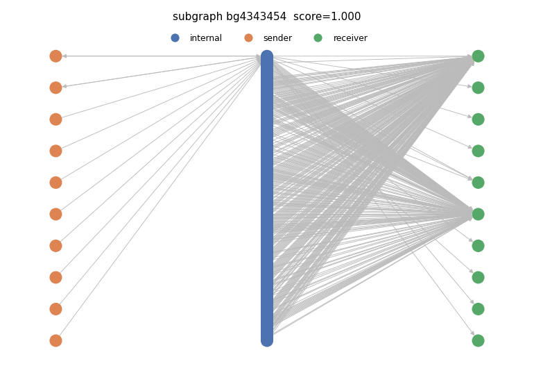
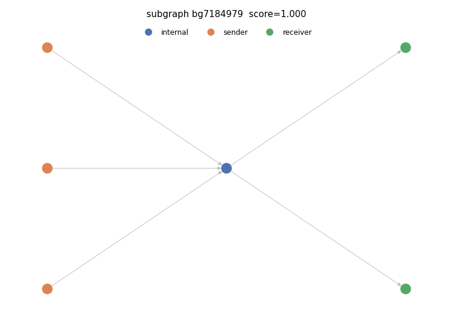

# Example investigative cards — *discovered* novel fraud leads

These six cards are the **top-ranked novel candidate subgraphs the pipeline discovered on
its own** in the ~48.8M **unlabeled** background clusters (not part of any labeled subgraph).
Each is a border-model score, an LLM typology, a corroborating ≤k-hop exit path to a licit
endpoint, and a rendered **border graph**.

Every graph reads left → right:

- **senders** (orange) — external clusters that *fund* the subgraph (in-neighbours of members)
- **internal** (blue) — the candidate cluster(s) themselves
- **receivers** (green) — external clusters the subgraph *pays out to* (out-neighbours)

This border structure — *who funds it* and *who it pays* — is what the detection model keys
on (the RevClassify insight: licit vs. suspicious internal shape is nearly identical; the
border carries the signal).

| Card | Discovered subgraph | Discovery score | Graph |
|---|---|---|---|
| [card_005](card_005_ccbg25364052.md) | bg25364052 | 1.000 |  |
| [card_001](card_001_ccbg4343454.md) | bg4343454 | 1.000 |  |
| [card_002](card_002_ccbg33939080.md) | bg33939080 | 1.000 |  |
| [card_003](card_003_ccbg7106753.md) | bg7106753 | 1.000 |  |
| [card_004](card_004_ccbg7301164.md) | bg7301164 | 1.000 |  |
| [card_006](card_006_ccbg7184979.md) | bg7184979 | 1.000 |  |

> ⚠️ These are **investigative leads, not confirmed fraud** — the model flags structures that
> resemble known laundering for a human analyst to review. See [../../RESULTS.md](../../RESULTS.md).
