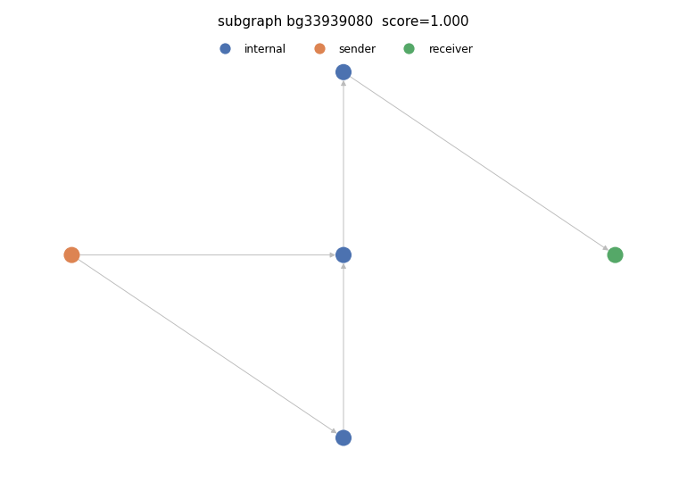

# Suspicious subgraph 1

- PU score: 0.999997 (percentile 99.5%)
- Typology: nested_service (confidence 0.82) — FLAGGED (structural contradiction)
  - Validation: structural signals imply 'nested_service', contradicting model 'peeling_chain'; overridden to structural reading

## Exit path(s)
Heuristic licit endpoint type: heuristic licit endpoint (Stage-3 reachability)
- 11985287 -> 212

## Structural evidence
- max_in_degree: 2
- max_out_degree: 2
- n_edges: 5
- n_internal: 3
- n_receivers: 1
- n_senders: 1

## Model rationale
A single sender fans out through a small chain of internal hops with max in/out degree of 2, ultimately converging to a single receiver via a linear exit path — consistent with a peeling chain where funds are progressively stripped off through intermediate nodes.

Cited evidence:
- Single sender (36941) and single receiver (212) with 3 internal nodes forming a narrow chain
- Max in-degree and max out-degree both equal 2, indicating simple branching/merging typical of peeling
- Linear exit path [11985287 -> 212] shows funds funneled to one endpoint after intermediate hops
- Node 36941 splits to two intermediaries (11985657, 33939080), which reconverge at 11985657 before exiting — classic peel-and-merge pattern
- Internal nodes have near-zero bins for most features except pass-through volume indicators, consistent with transient peeling hops
- PU suspicion score of 0.999997 confirms high anomaly signal
- Small subgraph (5 nodes, 5 edges) with no fan-out to multiple receivers rules out smurfing or consolidation

## Caveats
- This is an automatically generated INVESTIGATIVE LEAD, not a finding or an accusation. It requires human review before any action.
- The PU suspicion score is a positive-unlabeled (SCAR) lower bound: the unlabeled pool contains benign clusters, so a high score is not proof of illicit activity.
- Node roles and the licit endpoint type are DERIVED heuristics, not ground-truth entity labels — the dataset ships none.
- The typology is a model verdict; treat a flagged (structurally contradicted) typology with extra caution.
- False positives are expected. Corroborate independently before escalating.

