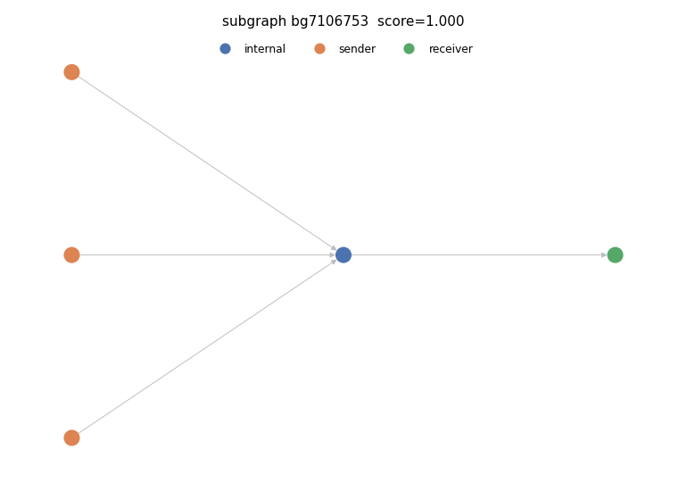

# Suspicious subgraph 2

- PU score: 0.999864 (percentile 99.0%)
- Typology: consolidation (confidence 0.97)
  - Validation: model typology corroborated by structural signals

## Exit path(s)
Heuristic licit endpoint type: heuristic licit endpoint (Stage-3 reachability)
- 7106753 -> 4

## Structural evidence
- max_in_degree: 3
- max_out_degree: 1
- n_edges: 4
- n_internal: 1
- n_receivers: 1
- n_senders: 3

## Model rationale
Multiple distinct sender nodes funnel funds into a single internal node which then forwards to one receiver, forming a classic fan-in consolidation pattern with no branching or chaining.

Cited evidence:
- 3 sender nodes (36860, 36941, 9741816) all direct edges into a single internal node (7106753)
- max_in_degree of 3 on the internal node confirms multi-input aggregation
- max_out_degree of 1 indicates a single outbound flow from the aggregator to receiver node 4
- n_senders=3, n_internal=1, n_receivers=1 ratio is archetypal of consolidation topology
- Single exit path [7106753 -> 4] with no branching rules out peeling chain or layering
- PU suspicion score of 0.9999 consistent with structured fund aggregation behavior

## Caveats
- This is an automatically generated INVESTIGATIVE LEAD, not a finding or an accusation. It requires human review before any action.
- The PU suspicion score is a positive-unlabeled (SCAR) lower bound: the unlabeled pool contains benign clusters, so a high score is not proof of illicit activity.
- Node roles and the licit endpoint type are DERIVED heuristics, not ground-truth entity labels — the dataset ships none.
- The typology is a model verdict; treat a flagged (structurally contradicted) typology with extra caution.
- False positives are expected. Corroborate independently before escalating.

