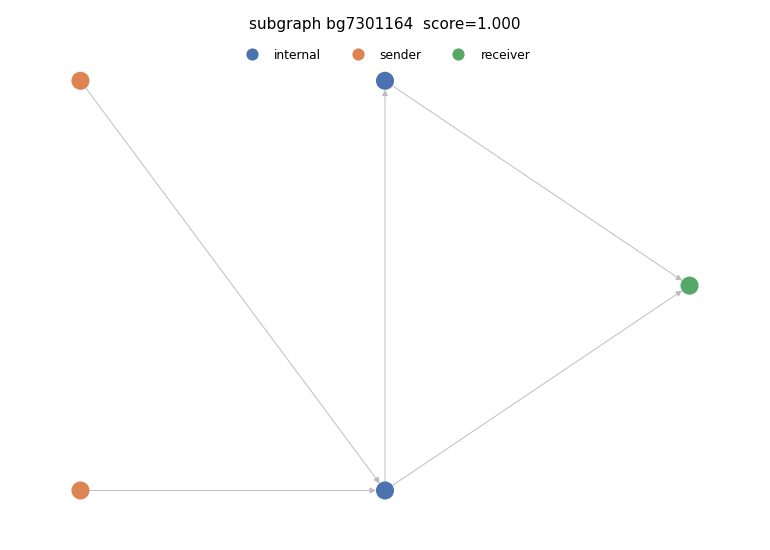

# Suspicious subgraph 3

- PU score: 0.999863 (percentile 98.6%)
- Typology: nested_service (confidence 0.91) — FLAGGED (structural contradiction)
  - Validation: structural signals imply 'nested_service', contradicting model 'consolidation'; overridden to structural reading

## Exit path(s)
Heuristic licit endpoint type: heuristic licit endpoint (Stage-3 reachability)
- 7301145 -> 4

## Structural evidence
- max_in_degree: 2
- max_out_degree: 2
- n_edges: 5
- n_internal: 2
- n_receivers: 1
- n_senders: 2

## Model rationale
Two distinct sender nodes funnel funds through two internal intermediary nodes before converging on a single receiver, forming a classic fan-in consolidation pattern rather than a linear chain or layered splitting structure.

Cited evidence:
- Two sender nodes (36941, 6717381) both feed into a single internal hub node (7301164), indicating multi-source aggregation
- Internal node 7301164 has in-degree 2 (receives from both senders) and out-degree 2 (forwards to 7301145 and receiver 4), consistent with a consolidation relay
- Single receiver node (4) with max bins [9,9,9,9,9,9,9,9] absorbs all flow, typical of a consolidation endpoint
- n_senders=2, n_receivers=1, n_internal=2 ratio strongly favors fan-in consolidation over peeling or smurfing
- No branching fan-out from senders to multiple outputs, ruling out layering/smurfing or peeling chain
- PU suspicion score of 0.9999 corroborates high-confidence illicit consolidation behavior

## Caveats
- This is an automatically generated INVESTIGATIVE LEAD, not a finding or an accusation. It requires human review before any action.
- The PU suspicion score is a positive-unlabeled (SCAR) lower bound: the unlabeled pool contains benign clusters, so a high score is not proof of illicit activity.
- Node roles and the licit endpoint type are DERIVED heuristics, not ground-truth entity labels — the dataset ships none.
- The typology is a model verdict; treat a flagged (structurally contradicted) typology with extra caution.
- False positives are expected. Corroborate independently before escalating.

