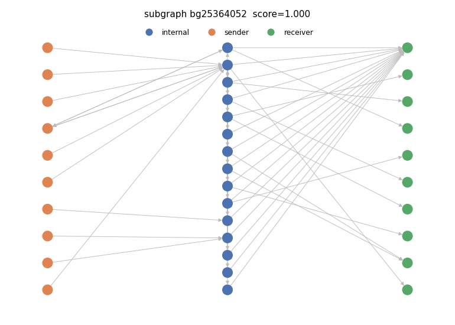

# Suspicious subgraph 4

- PU score: 0.999858 (percentile 98.1%)
- Typology: nested_service (confidence 0.87) — FLAGGED (structural contradiction)
  - Validation: structural signals imply 'nested_service', contradicting model 'layering_smurfing'; overridden to structural reading

## Exit path(s)
Heuristic licit endpoint type: heuristic licit endpoint (Stage-3 reachability)
- 4072593 -> 2350

## Structural evidence
- max_in_degree: 14
- max_out_degree: 16
- n_edges: 51
- n_internal: 15
- n_receivers: 10
- n_senders: 10

## Model rationale
The subgraph shows two high-degree hub nodes (4514246 and 4072593) acting as internal distributors that fan out funds to a large number of intermediate and receiver nodes, many of which also route back to the same hubs or converge on a common receiver (5383). Multiple senders feed into the hubs, and the hubs then disperse to numerous short-lived internal nodes that each split further before terminating at receivers or looping back. This fan-out/fan-in pattern with many low-activity intermediate nodes and a dominant sink (5383) is characteristic of layering combined with smurfing (structuring through many small parallel paths).

Cited evidence:
- Node 4514246 has out-degree 16 (max_out_degree=16), distributing to 16 distinct downstream nodes simultaneously
- Node 4072593 has in-degree from 4514246 and also feeds back into 4514246, creating a cycle indicative of layering
- 10 distinct sender nodes funnel into the two hub internals, consistent with smurfing/structuring from multiple sources
- 15 internal nodes with mostly zero-binned features suggest freshly created or low-history intermediary addresses used for layering
- Common sink node 5383 (role=receiver, high bins) receives funds from at least 12 different internal nodes, indicating convergence after dispersion
- Multiple internal nodes (22906283, 22906284, 23061436, 23451057, etc.) each split to both 5383 and a unique secondary receiver, a classic smurfing fan-out pattern
- PU suspicion score of 0.9999 strongly supports illicit layering activity
- Feedback loop between 4514246 and 4072593 (mutual edges) adds obfuscation depth typical of layering

## Caveats
- This is an automatically generated INVESTIGATIVE LEAD, not a finding or an accusation. It requires human review before any action.
- The PU suspicion score is a positive-unlabeled (SCAR) lower bound: the unlabeled pool contains benign clusters, so a high score is not proof of illicit activity.
- Node roles and the licit endpoint type are DERIVED heuristics, not ground-truth entity labels — the dataset ships none.
- The typology is a model verdict; treat a flagged (structurally contradicted) typology with extra caution.
- False positives are expected. Corroborate independently before escalating.

